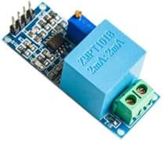
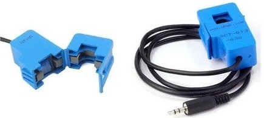

# Smart-Energy-Monitoring-System
This project has been inspired by [how to electronic](https://how2electronics.com/iot-based-electricity-energy-meter-using-esp32-blynk/) 
Following sensors are used to monitor voltages and Current: 
AC voltage sensor [zmpt101b](https://pdf1.alldatasheet.com/datasheet-pdf/view/1131993/ETC2/ZMPT101B.html)        |  Current sensor [SCT-013](https://bc-robotics.com/datasheets/yhdc.pdf)
:-------------------------:|:-------------------------:
  |  
# Block Diagram
